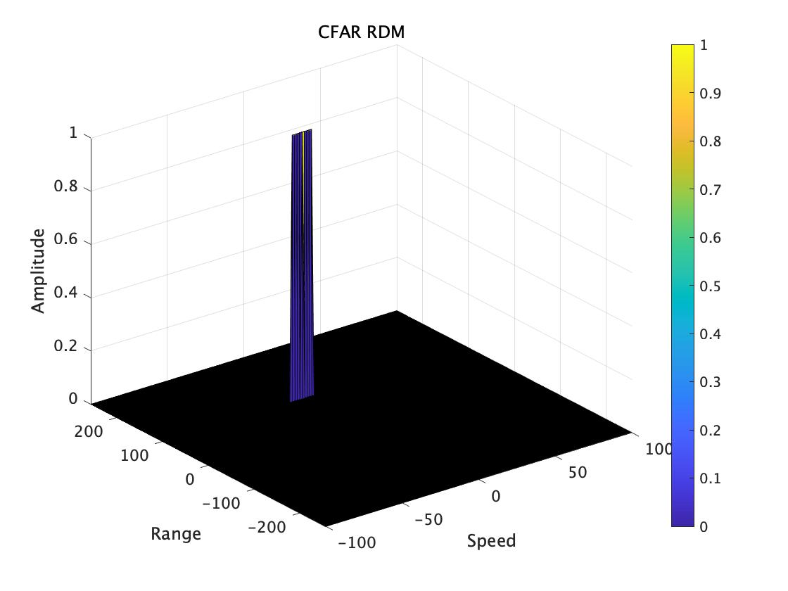

# Radar Target Generation and Detection

## Radar Specifications

Frequency of operation = 77GHz  
Max Range = 200m  
Range Resolution = 1 m  
Max Velocity = 100 m/s  

## FMCW Waveform Generation

Bsweep = speed_of_light / (2 * range_resolution) 
Tchirp = (5.5 * 2 * max_range) / speed_of_light  
Slope = Bsweep / Tchirp  

from this.

Bandwidh = 150Mhz  
Chirp Period = 7.3us
Slope = 20.45Mhz/us

## Signal generation and Moving Target simulation
Running the radar scenario over the time. 

for i=1:length(t)        
    %For each time stamp update the Range of the Target for constant velocity. 
    
    r_t(i) = target_position + (t(i) * target_velocity);
    td(i) = (2 * r_t(i)) / speed_of_light;
    
    %For each time sample we need update the transmitted and
    %received signal. 
 
    Tx(i) = cos(2*pi*( fc*(t(i)) + (0.5 * Slope * t(i)^2)));
    Rx(i) = cos(2*pi*( fc*(t(i)-td(i)) + ( 0.5 * Slope * (t(i)-td(i))^2)));
    
    %Mixing the Transmit and Receive generate the beat signal
    %This is done by element wise matrix multiplication of Transmit and
    %Receiver Signal
    Mix(i) = Tx(i).*Rx(i);
    
end

## RANGE MEASUREMENT

result of FFT 

## CFAR implementation
slide Window through the complete Range Doppler Map

training_range = 10;
training_doppler = 10;
guard_range = 3;
guard_doppler = 3;

% offset the threshold by SNR value in dB
offset = 1;

