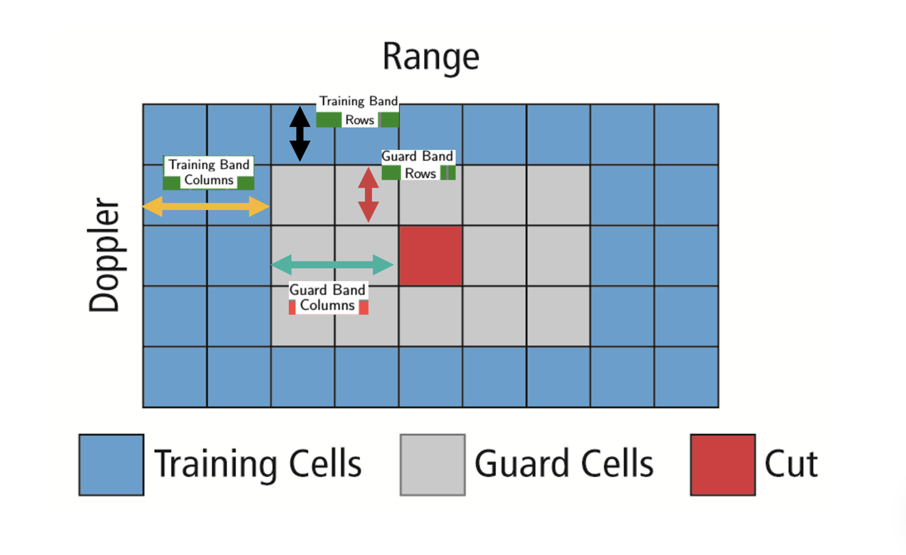

# Radar Target Generation and Detection

## Radar Specifications

Frequency of operation = 77GHz  
Max Range = 200m  
Range Resolution = 1 m  
Max Velocity = 100 m/s  

## FMCW Waveform Generation

Bsweep = speed_of_light / (2 * range_resolution) 
Tchirp = (5.5 * 2 * max_range) / speed_of_light  
Slope = Bsweep / Tchirp  

from this.

Bandwidh = 150Mhz  
Chirp Period = 7.3us
Slope = 20.45Mhz/us

## Signal generation and Moving Target simulation
Running the radar scenario over the time. 

for i=1:length(t)        
    %For each time stamp update the Range of the Target for constant velocity. 
    
    r_t(i) = target_position + (t(i) * target_velocity);
    td(i) = (2 * r_t(i)) / speed_of_light;
    
    %For each time sample we need update the transmitted and
    %received signal. 
 
    Tx(i) = cos(2*pi*( fc*(t(i)) + (0.5 * Slope * t(i)^2)));
    Rx(i) = cos(2*pi*( fc*(t(i)-td(i)) + ( 0.5 * Slope * (t(i)-td(i))^2)));
    
    %Mixing the Transmit and Receive generate the beat signal
    %This is done by element wise matrix multiplication of Transmit and
    %Receiver Signal
    Mix(i) = Tx(i).*Rx(i);
    
end

## RANGE MEASUREMENT

result of FFT 

## CFAR 

The CFAR technique estimates the level of interference in radar range and doppler cells “Training Cells” on either or both the side of the “Cell Under Test”. The estimate is then used to decide if the target is in the Cell Under Test (CUT).

The process loops across all the range cells and decides the presence of target based on the noise estimate.The basis of the process is that when noise is present, the cells around the cell of interest will contain a good estimate of the noise, i.e. it assumes that the noise or interference is spatially or temporarily homogeneous. Theoretically it will produce a constant false alarm rate, which is independent of the noise or clutter level

## 2D CFAR implementation

Implimented in line 155-243 in radar_target_generation_and_detection.m file.

Steps are folows:

1. Determine the number of Training cells for each dimension. 

2. Slide the cell under test across the complete matrix. 

3. For every iteration sum the signal level within all the training cells. To sum convert the value from logarithmic to linear.

4. Average the summed values for all of the training cells used. After averaging convert it back to logarithmic.

5. Add the offset to it to determine the threshold.

6. Compare the signal under CUT against this threshold.
If the CUT level > threshold assign it a value of 1, else equate it to 0.

Determine the number of training celss for each dimention and guard cells.

training_range = 10;
training_doppler = 10;
guard_range = 3;
guard_doppler = 3;

Offset the threshold by SNR value in dB
offset = 1;

## Steps taken to suppress the non-thresholded cells at the edges

The process above will generate a thresholded block, which is smaller 
than the Range Doppler Map as the CUT cannot be located at the edges of
matrix. Hence,few cells will not be thresholded. To keep the map size same
set those values to 0. 

[h, w] =  size(RDM); 

for i = 1:h
    for j = 1:w
        if(RDM(i,j) ~= 0 && RDM(i,j) ~= 1)
            RDM(i,j) = 0;
        end
    end
end

## Result

<image src="images/f3.jpg" />